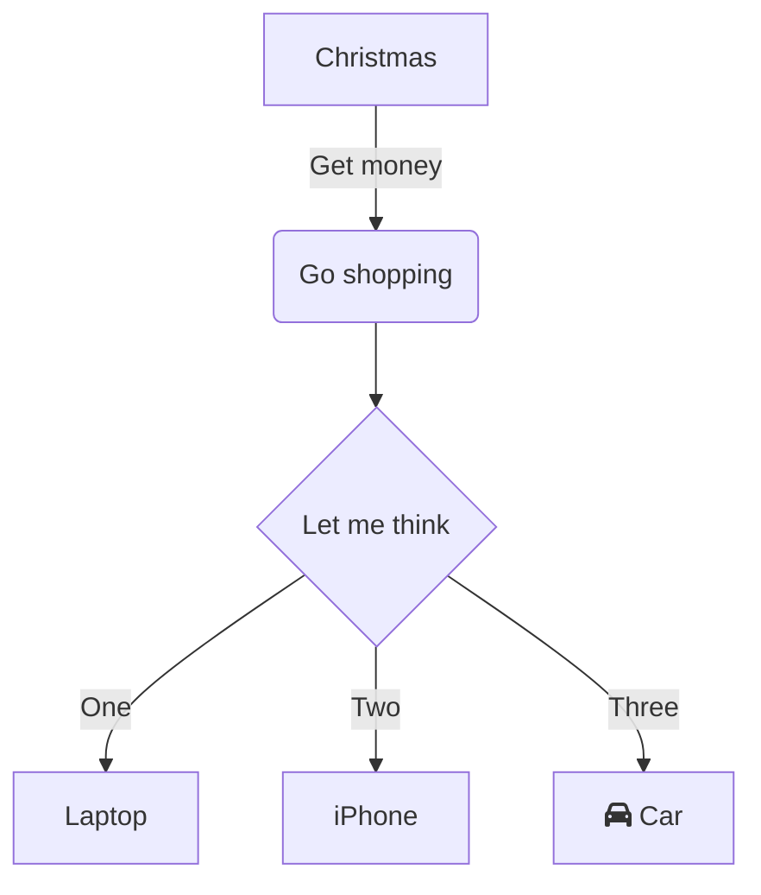
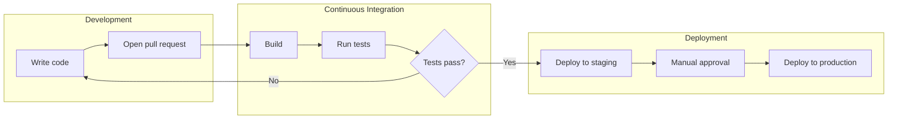
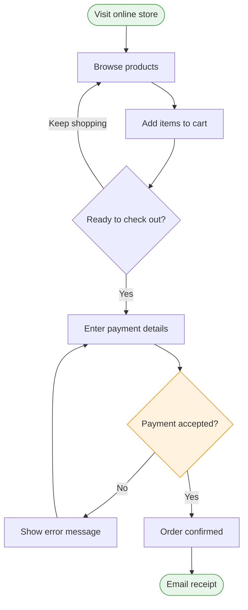
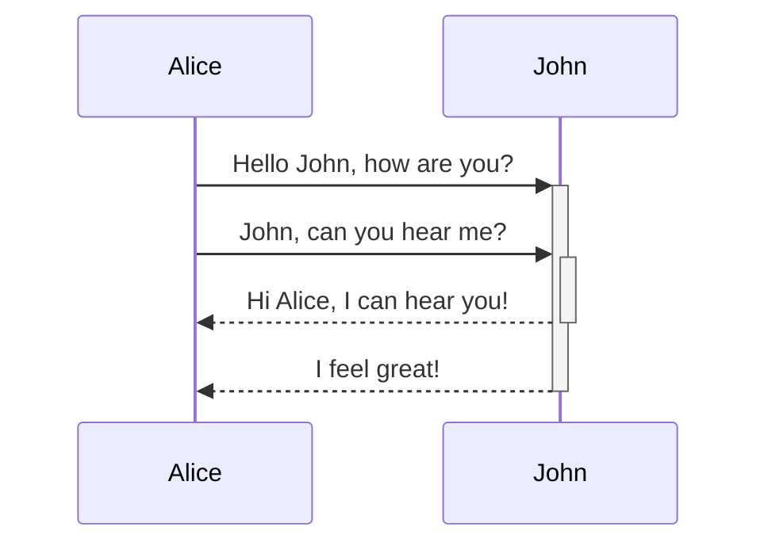
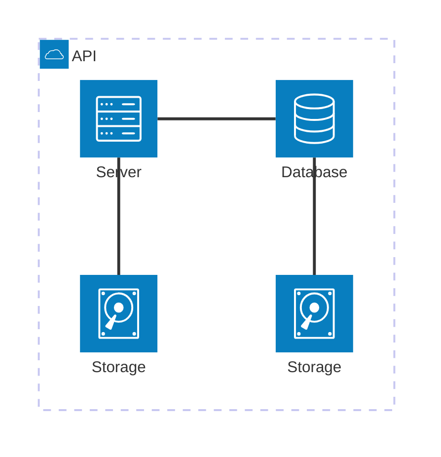
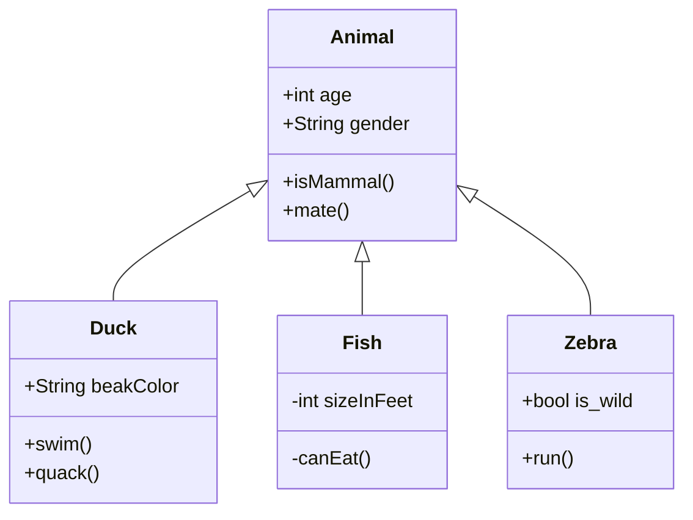
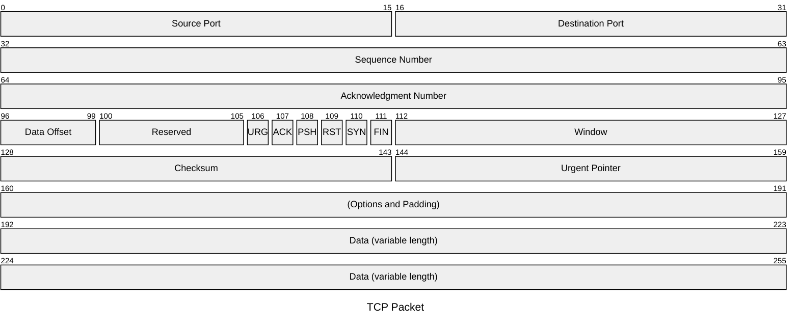
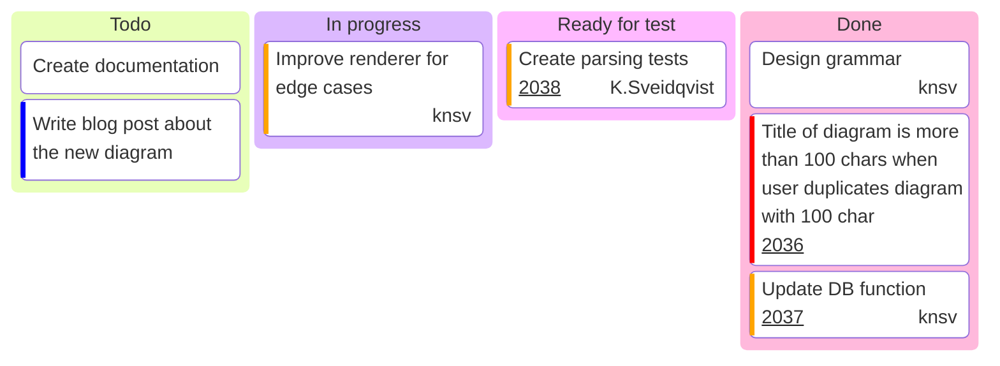

# mermaid图表测试

[【更多图表】](https://mermaid.live)
















```mermaid
stateDiagram-v2
    [*] --> Still
    Still --> [*]
    Still --> Moving
    Moving --> Still
    Moving --> Crash
    Crash --> [*]
```





