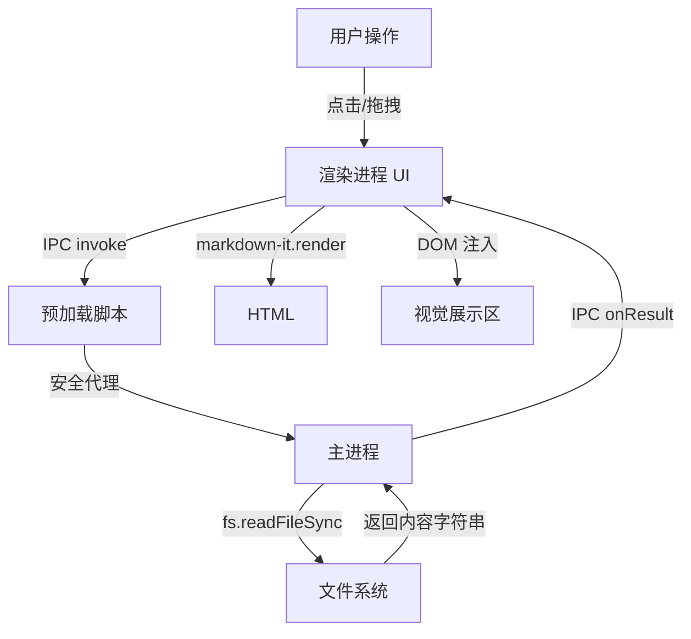


# 产品设计文档：Markdown 阅读器（第一阶段）

**项目名称**：MarkdownReader (CodeName: Tyro)  
**文档版本**：v1.0  
**撰写日期**：2026-07-29 

---

## 1. 引言

### 1.1 项目背景
旨在打造一款轻量级、高性能的桌面 Markdown 阅读工具。第一阶段作为基石，专注于提供**极致的只读体验**，不包含编辑、保存等复杂逻辑，确保用户打开 Markdown 文件时能获得与 GitHub 主题几乎无差的视觉享受。

### 1.2 目标
- 支持通过菜单栏、快捷键、拖拽三种方式打开 `.md` 或 `.markdown` 文件。
- 将 Markdown 语法实时渲染为与 **GitHub 主题** 视觉完全一致的 HTML 内容。
- 提供流畅的滚动体验和代码高亮支持。

### 1.3 非目标（明确排除）
- **不包含** 光标编辑、输入框或所见即所得（WYSIWYG）的写作文本区。
- **不包含** 保存、另存为或导出为 PDF/HTML 的功能。
- **不包含** 侧边栏目录树或文件管理器。

---

## 2. 技术架构选型

| 组件 | 技术选型 | 理由 |
| :--- | :--- | :--- |
| **桌面框架** | Electron v28+ | 跨平台（Win/macOS/Linux），使用 Web 技术栈，生态成熟。 |
| **Markdown 解析** | `markdown-it` | 插件化架构，性能极佳，扩展性强（未来可轻松添加图表/公式）。 |
| **代码高亮** | `highlight.js` | 支持 190+ 种语言，社区活跃。 |
| **基础样式** | `github-markdown-css` | 官方 GitHub 样式基线，确保基础排版 100% 还原。 |
| **进程通信** | Context Bridge + IPC | 严格遵循 Electron 安全规范，隔离 Node 环境，防止 XSS 攻击。 |

---

## 3. 系统架构图（流程设计）



**设计原则**：
- **主进程**：仅负责文件 I/O 读取和窗口生命周期管理。
- **渲染进程**：仅负责 UI 交互与渲染，**绝对不**直接操作 Node.js API（`fs`, `path`）。
- **安全隔离**：启用 `contextIsolation: true`，所有 API 通过 `window.electronAPI` 暴露。

---

## 4. 模块功能详细设计

### 4.1 文件加载模块
| 功能点 | 触发方式 | 交互反馈 |
| :--- | :--- | :--- |
| **菜单栏打开** | 顶部按钮或 `Ctrl/Cmd + O` | 弹出原生系统对话框（仅限 `.md`, `.markdown`）。 |
| **拖拽打开** | 从操作系统拖拽文件至应用窗口 | 鼠标移入时显示高亮遮罩层，释放后立即加载。 |
| **URL 参数（可选）** | 终端启动时传入文件路径 | 应用启动时自动加载该路径文件（如 `electron . test.md`）。 |

**异常处理**：
- 文件不存在 → 提示“文件不存在或已被移动”。
- 编码非 UTF-8 → 尝试自动检测编码（如 GBK）或降级为 `latin1`（基于 `iconv-lite`）。

### 4.2 渲染引擎模块
- **解析器配置**：实例化 `markdown-it` 并开启 `html: false`（默认禁止内嵌 HTML 防范 XSS），启用 `linkify`（自动识别链接）和 `typographer`（优化引号/破折号）。
- **代码高亮逻辑**：捕获 `markdown-it` 的 `highlight` 回调，调用 `hljs.highlightAuto` 或指定语言，生成带有 `hljs` 类名的 `<code>` 块。
- **内联样式优化**：注入 `github-markdown.css` 作为基础，随后加载自定义 `overwrite.css` 用以调整 GitHub 主题的细节（如标题下边框加粗、表格内边距微调）。

### 4.3 用户界面（UI）设计
- **布局**：极简主义，顶部栏（高度 50px）包含应用标题与文件路径；主内容区（剩余高度）作为滚动容器。
- **内容容器**：包裹 `.markdown-body` 类，固定最大宽度 `860px`，左右自动居中，上下内边距设定为 `50px` 以模拟舒适留白。
- **状态栏（可选）**：窗口底部显示当前渲染的字数/行数统计（仅展示，不涉及交互）。

---

## 5. 数据流与状态管理

由于第一阶段为单向数据流，状态管理极简：

| 状态变量 | 类型 | 说明 |
| :--- | :--- | :--- |
| `currentFilePath` | `string` | 当前打开文件的绝对路径（用于展示在标题栏）。 |
| `rawMarkdown` | `string` | 从磁盘读取的原始文本内容。 |
| `renderedHTML` | `string` | 经过 `markdown-it` 渲染后的 HTML 字符串。 |

**状态流转**：
`闲置` → `用户触发加载` → `读取文件(loading)` → `渲染完成(loaded)` → `显示内容`。

---

## 6. 安全性设计（重点）

鉴于 `markdown-it` 若开启 `html: true` 会引发 XSS 风险，第一阶段设计明确：

1. **强制关闭 HTML 内嵌**：`markdown-it` 配置中 `html: false`。
2. **CSP（内容安全策略）**：在 HTML 的 `<meta>` 标签中设置严格策略，禁止 `unsafe-inline` 脚本执行（除非是 `nonce` 方式，但本例无需）。
3. **路径校验**：主进程在读取文件前，校验文件后缀名是否在白名单内（`['.md', '.markdown']`），防止系统敏感文件被读取（虽然用户主动打开，但安全习惯需保持）。

---

## 7. 性能指标

| 指标 | 目标值 | 衡量方式 |
| :--- | :--- | :--- |
| **首屏加载（空窗）** | < 500ms | 从点击到窗口就绪。 |
| **大文件渲染（>10万字）** | < 1.5s | 主线程解析及回流耗时，不阻塞 UI 滚动。 |
| **内存占用** | 闲置 < 80MB，加载大文件 < 150MB | 任务管理器监控。 |
| **滚动帧率** | 60 FPS | 利用 CSS `will-change: transform` 优化滚动层。 |

---

## 8. 测试验收标准（AC）

1. **[正向]** 双击打开 5 个不同样式的 Markdown 文件（含表格、代码块、数学公式占位符），渲染结果与 GitHub 主题截图对比，肉眼无明显差异。
2. **[边界]** 尝试打开一个 50MB 的超大 Markdown 文件，应用不应崩溃，滚动条响应正常。
3. **[异常]** 拖拽一个 `.exe` 或 `.txt` 文件到窗口，系统应忽略或提示“不支持的文件格式”。
4. **[安全]** 在 Markdown 中写入 `<script>alert('xss')</script>`，渲染后应显示为纯文本或代码，而不是弹窗。

---

## 9. 后续迭代展望（Phase 2+）

- **编辑模式**：引入 `CodeMirror` 或 `Monaco` 编辑器，实现源码与预览分屏。
- **实时预览**：监听文件系统变动（`fs.watch`），当文件被外部修改时自动重绘。
- **主题切换**：增加深色模式（Dark Mode）支持。

---

## 10. 附录：关键目录结构

```text
project-root/
├── src/
│   ├── main/           # 主进程
│   │   └── index.js
│   ├── renderer/       # 渲染进程
│   │   ├── index.html
│   │   ├── renderer.js
│   │   └── styles/
│   │       ├── github-markdown.css  # (npm包拷贝)
│   │       └── custom.css            # 覆盖样式
│   └── preload/
│       └── preload.js
├── package.json
└── README.md
```

---
